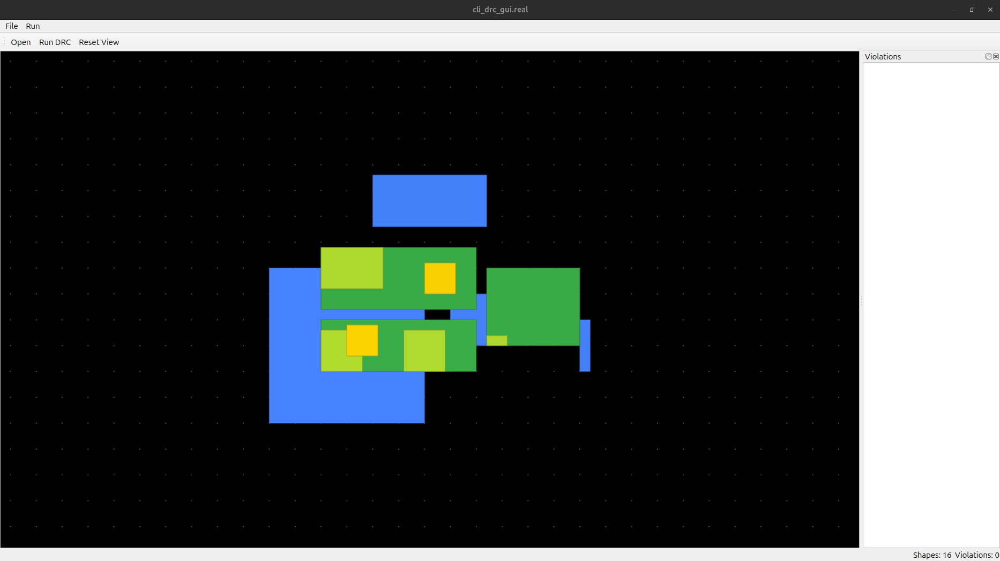
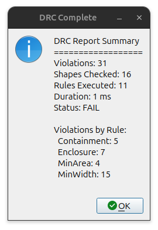
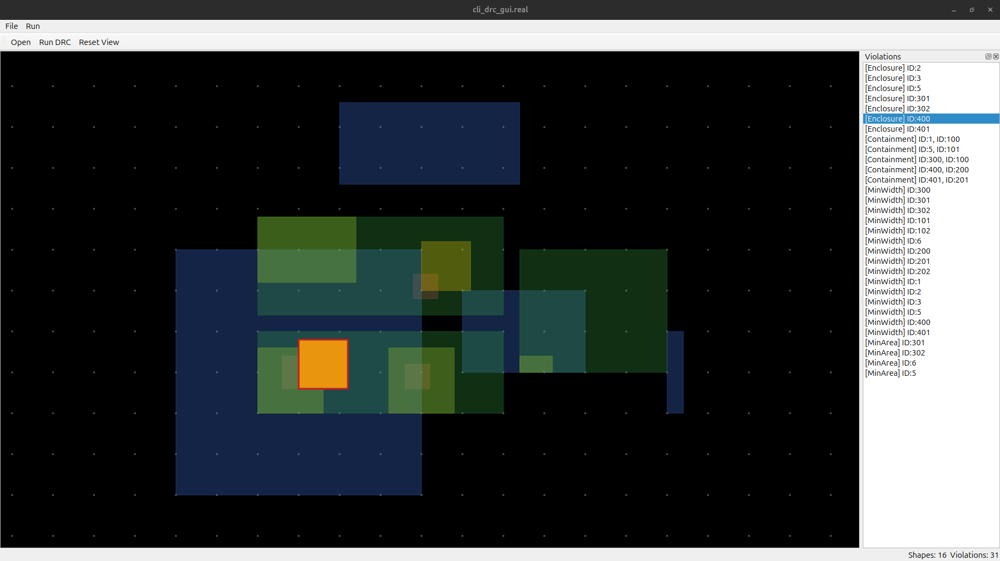

# DRC Engine

## Overview

Design Rule Checking (DRC) is a critical process in Electronic Design Automation (EDA) that verifies whether an integrated circuit layout adheres to manufacturing constraints and design rules. This project implements a simplified DRC engine in modern C++ to demonstrate core concepts of spatial indexing, rule-based validation, and graphical visualization in EDA tools.

The engine efficiently checks geometric constraints on semiconductor layouts, identifying violations such as insufficient spacing between shapes, improper enclosures, and minimum size requirements. By leveraging spatial data structures and modern C++ features, it provides a foundation for understanding how commercial DRC tools operate.

## Features

- **Modern C++ Implementation**: Written in C++17 or later with clean, maintainable code
- **Efficient Spatial Indexing**: Uses Boost R-tree for O(log N) spatial queries, avoiding O(N²) brute-force checking
- **Comprehensive Rule Support**: Implements multiple DRC rule types for layout validation
- **JSON Layout Loading**: Supports loading semiconductor layouts from JSON format files
- **Command-Line Interface**: Provides a CLI tool for batch processing and automated checks
- **Qt-Based GUI**: Interactive visualization with layer coloring and violation highlighting
- **Violation Reporting**: Detailed reports of rule violations with location information
- **Performance Optimized**: Handles dense layouts efficiently through spatial indexing

## Architecture

The project follows a modular architecture with clear separation of concerns:

### Layout Representation
- **Shape**: Basic geometric primitives (rectangles, polygons)
- **Layer**: Logical grouping of shapes with rendering properties
- **Layout**: Complete design hierarchy containing multiple layers

### DRC Engine
- **DrcEngine**: Core validation engine that orchestrates rule checking
- **DrcContext**: Execution context managing layout state and rule parameters
- **DrcReport**: Structured reporting of violations with severity and location

### Rule System
- **Rule Classes**: Modular implementation of different DRC checks
- **Rule Evaluation**: Efficient spatial queries to identify violating geometries

### Spatial Indexing
- **R-Tree Implementation**: Boost.Geometry R-tree for fast proximity queries
- **Query Optimization**: Reduces computational complexity from O(N²) to O(N log N)

### GUI Visualization
- **Qt Framework**: Cross-platform GUI for layout viewing
- **Violation Highlighting**: Red overlays on violating geometries
- **Layer Coloring**: Distinct colors for different design layers

## Supported Rules

The engine implements several fundamental DRC rules:

- **Minimum Spacing**: Ensures adequate separation between adjacent shapes on the same layer
- **Intersection Detection**: Identifies overlapping geometries that violate design rules
- **Enclosure**: Verifies that one shape properly contains another with sufficient margin
- **Containment**: Checks that shapes are fully contained within specified boundaries
- **Minimum Width**: Enforces minimum width constraints for wires and traces
- **Minimum Area**: Validates minimum area requirements for shapes and vias

## Example

Run DRC checks on a layout file using the command-line interface:

```bash
# Build the project first
mkdir build && cd build
cmake .. && make

# Run DRC on a layout and a separate rules file
./bin/cli_drc ../examples/layout_only_example.json --rules ../examples/rules_only_example.json
```

Sample output:
```
DRC Check Results:
Total violations found: 3

Violation 1: MinSpacingRule violation
Layer: METAL1
Location: (100, 200) - (150, 250)
Description: Spacing violation between shapes

Violation 2: MinWidthRule violation
Layer: METAL1
Location: (300, 400) - (320, 450)
Description: Width below minimum requirement

Violation 3: IntersectionRule violation
Layer: VIA1
Location: (500, 600) - (520, 620)
Description: Shapes intersect illegally
```

## GUI

The Qt-based graphical interface provides an intuitive way to visualize layouts and inspect violations:

- **Layout View**: Renders the complete design with proper layer coloring
- **Violation Highlighting**: Violations are overlaid in red for immediate identification
- **Zoom and Pan**: Navigate large layouts with smooth controls
- **Layer Toggle**: Show/hide individual layers for focused inspection
- **Violation Details**: Click on violations to view detailed information

Launch the GUI with:
```bash
./bin/cli_drc_gui ../examples/layout_sample.json
```

## Screenshots


*Figure 1: Initial layout import showing layered semiconductor design*


*Figure 2: DRC report summary displaying violation statistics*


*Figure 3: Violation highlighting with red overlays on problematic areas*

## Build Instructions

### Prerequisites
- C++17 compatible compiler (GCC 7+, Clang 5+, MSVC 2017+)
- CMake 3.10 or later
- Qt5 development libraries
- Boost libraries (geometry component)

### Linux/macOS Build
```bash
# Clone the repository
git clone https://github.com/Arsh2508/drc-engine.git
cd drc-engine

# Create build directory
mkdir build && cd build

# Configure with CMake
cmake ..

# Build the project
make

# Optional: Install (may require sudo)
make install
```

### Windows Build
```batch
# Using Visual Studio Developer Command Prompt
mkdir build && cd build
cmake .. -G "Visual Studio 16 2019"
cmake --build . --config Release
```

## Project Structure

```
├── src/                    # Source code directory
│   ├── app/               # Main application entry points
│   ├── core/              # Core DRC engine implementation
│   ├── drc/               # DRC rule and reporting classes
│   ├── geometry/          # Geometric primitives and utilities
│   ├── gui/               # Qt-based GUI components
│   ├── io/                # File I/O and parsing utilities
│   ├── layout/            # Layout data structures
│   ├── rules/             # Individual DRC rule implementations
│   ├── spatial/           # Spatial indexing implementations
│   └── tests/             # Unit tests
├── include/               # Public header files
├── examples/              # Sample layout files and documentation
├── docs/                  # Documentation and screenshots
├── CMakeLists.txt         # CMake build configuration
└── README.md             # This file
```

## Example Layouts

The `examples/` directory contains several JSON layout files demonstrating different scenarios:

- `layout_sample.json`: Basic layout with various shape types
- `layout_complex.json`: Dense layout showcasing spatial indexing performance
- `semiconductor_design.json`: Realistic IC layout excerpt
- `basic_spacing_violations.json`: Layout with intentional spacing violations

Use these files to test the DRC engine and understand different rule behaviors.

## Future Improvements

Several enhancements could extend the engine's capabilities:

- **Additional Rule Types**: Implement more complex rules like notch detection, corner spacing, and density checks
- **Performance Optimizations**: GPU acceleration for large-scale layouts, parallel processing
- **Advanced GUI Features**: Violation filtering, measurement tools, design editing capabilities
- **File Format Support**: GDSII, OASIS, and other industry-standard layout formats
- **Rule Customization**: User-defined rules through scripting or configuration files
- **Integration APIs**: RESTful API for integration with larger EDA workflows
- **3D Visualization**: Support for multi-layer 3D visualization and cross-layer checks

---

*This project serves as a demonstration of C++ software engineering principles in the EDA domain. For production use, consider commercial DRC tools like those from Synopsys, Cadence, or Mentor Graphics.*